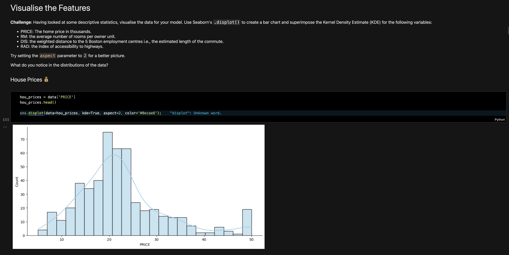

# 🏠 Predict House Prices

A machine learning project that predicts house prices using multiple variable regression. The project uses the boston.csv dataset and involves comprehensive data analysis, visualization, and model training to determine the relationship between various factors and house prices.

---

## 📸 Screenshots

---

## ✨ Features

- Data Wrangling: Preprocessed and cleaned the dataset for analysis.
- Data Visualization: Created insightful visualizations to identify patterns and trends using Seaborn, Matplotlib, and Plotly.
- Machine Learning: Implemented multiple linear regression using Scikit-learn for price prediction.
- Model Evaluation: Split data into training and testing sets for performance evaluation.
---

## ⚙️ Tech Stack

- Pandas, NumPy: For data processing and manipulation.
- Seaborn, Plotly, Matplotlib: For creating interactive and static visualizations.
- Scikit-learn: For regression modeling and train-test splits.
